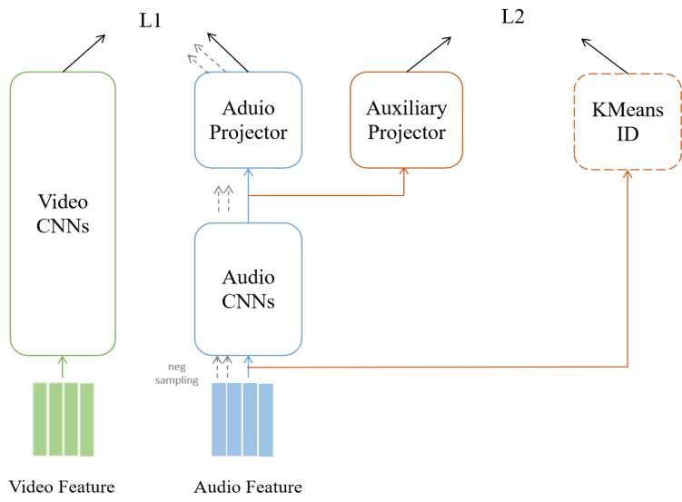

# 音视频匹配

## 一、任务要求

给定若干对无声视频与音频文件，使用机器学习方法，提取其视觉、听觉特征，并设计视听信息之间相似性的度量方法，评估无声视频与音频数据的匹配度，从而找回每个无声视频所对应的原始音频文件。除此以外，真实环境中采集的音视频信号往往存在噪声污染，在有噪声干扰的条件下如何实现准确的音视频匹配也是需要考虑的因素。

## 二、实现思路

### 2.1 模型架构

为了对音视频进行匹配，我们希望能够定义一种“相似度”，一对音视频之间的相似度越大，说明他们越匹配。基于此思想，我们希望神经网络的输入为视频与音频，输出为他们的相似度。

我们将神经网络设计为双塔结构，双塔分别对应于视频特征提取器和音频特征提取器。输入的视频经过视频特征提取器，得到视频特征向量；输入的音频经过音频特征提取器，得到音频特征向量。相似度方面，我们计算视频与音频特征向量的余弦相似度，作为这一对音视频的相似度。

### 2.2 模型优化

由于训练集样本量过大，在网络每步训练如果都计算一个视频与所有音频的相似度再进行优化，计算代价太大，而且效果不佳。因此，我们引入正负采样来降低计算量。

在网络训练阶段，每步训练，我们针对一个输入视频，将其匹配的音频视为正样本，并负采样若干个与该视频不匹配的音频作为负样本。我们使用交叉熵作为优化损失函数，希望网络能够识别出匹配的正样本。经过正负采样，计算代价大大降低。

### 2.3 辅助任务

使用上述结构的模型，效果已经比较不错，但仍存在几个问题：1.音频数据若有噪声，可能匹配会不准确；2.模型很容易过拟合。我们希望能够抵抗噪声并增加任务的复杂性，提升模型的能力，因此引入了一项无监督的辅助任务。

我们观察到数据集中的音视频可以分成多类：环境音频、语音、歌曲、乐器等。基于此，我们希望模型能够识别出某音频是属于哪一类的，我们相信如果模型能够准确地识别出音频的分类，会有助于抵抗噪声、提升分类准确性。借鉴于HuBERT的思想，对训练集音频作KMeans聚类，聚类数为超参数。每条音频都有属于自己的聚类标签，模型以预测出音频对应标签为辅助任务。

理论上对视频特征也可以做这一步，但我们在本次实验中并未对视频做KMeans聚类。

### 2.4 具体实现

我们主要使用卷积神经网络来实现，因为现有的文献表明卷积神经网络在音视频匹配任务中有比较好的表现。对于音视频匹配任务，用交叉熵作为损失函数$L_1$；对于预测KMeans标签的辅助任务，用交叉熵作为损失函数$L_2$。最终的损失函数L可写为如下形式：
$$
\begin{align*}
\begin{split}
L= \left \{
\begin{array}{}
    L_{1}+\beta L_{2},                    & if\quad epoch<N\\
    L_1     & otherwise
\end{array}
\right.
\end{split}
\end{align*}
$$
其中β 和N为超参数。

## 三、结果展示与分析

粗略估计样本集中有22类音视频，因此KMeans聚类数取22，令超参数β 和N分别为1、3，训练20个epoch。训练集占所有配对数据的90%，验证集占10%。部分实验结果如下：

| 学习率 | 是否使用KMeans | 整个验证集top1 acc% | 整个验证集top5 acc% | 整个验证集top50 acc% | 抽50样本top1 acc% | 抽50样本top5 acc% |
| ------ | -------------- | ------------------- | ------------------- | -------------------- | ----------------- | ----------------- |
| 0.0005 | ×              | 8.08                | 32.63               | 87.13                | 33.49             | 78.34             |
| 0.0005 | √              | 8.08                | 33.53               | 88.92                | 35.34             | 80.35             |
| 0.001  | √              | 8.08                | 33.53               | 88.92                | 34.96             | 79.94             |

可以看到KMeans是有一定效果的。我们取lr=0.0005，使用KMeans的模型作为最后的结果。

